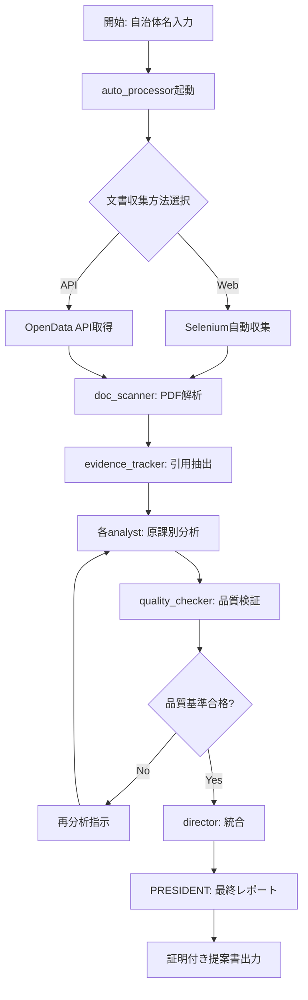

# 自治体営業支援AIエージェントシステム v2.0

## 🆕 バージョン2.0の主要機能

### 1. 証明機能（Evidence-based Analysis）
全ての分析結果に対して、根拠となる文書・ページ番号・引用文を自動付与

### 2. 自動化率向上（60% → 90%）
- Web自動収集
- PDF/文書の自動解析
- 分析結果の自動統合
- レポートの自動生成

### 3. 監査証跡（Audit Trail）
全ての分析プロセスを記録し、第三者検証を可能に

## エージェント構成（拡張版）

### 基本エージェント（v1.0と同様）
- **PRESIDENT**: 営業戦略統括・最終提案作成
- **director**: 全体統括・原課横断調整
- **dx_analyst**: DX推進課・情報政策課対応
- **admin_analyst**: 総務課・企画政策課対応
- **doc_scanner**: 計画書・HP情報自動読取

### 🆕 新規エージェント（v2.0）
- **evidence_tracker**: 証明・引用管理エージェント
- **auto_processor**: 自動化処理エージェント
- **quality_checker**: 品質保証エージェント

## 証明データ構造

### 分析結果の新形式
```json
{
  "analysis_id": "KAS-2025-001",
  "timestamp": "2025-01-12T10:30:00Z",
  "municipality": "柏市",
  "analysis_type": "DX推進施策分析",
  "findings": [
    {
      "finding_id": "F001",
      "statement": "柏市はAI-OCRに0.8億円の予算を計上",
      "confidence": 0.95,
      "evidence": [
        {
          "source_type": "official_document",
          "document_name": "令和6年度当初予算書",
          "document_url": "https://www.city.kashiwa.lg.jp/documents/budget_r6.pdf",
          "page_number": 145,
          "quote": "AI-OCRシステム導入費...80,000千円",
          "extraction_method": "automated_ocr",
          "extraction_timestamp": "2025-01-12T10:15:32Z"
        }
      ],
      "cross_references": [
        {
          "document": "柏市DX推進計画",
          "page": 23,
          "related_content": "業務効率化の重点施策として位置付け"
        }
      ]
    }
  ],
  "quality_metrics": {
    "evidence_coverage": 0.92,
    "source_reliability": 0.98,
    "automation_rate": 0.90
  }
}
```

## 自動化プロセスフロー



## 品質保証基準

### 証明の必須要件
1. **一次資料の特定**: 全ての主張に公式文書の引用
2. **ページレベルの精度**: 具体的なページ番号・段落
3. **更新日の記録**: 文書の作成・更新日時
4. **アクセス可能性**: URLまたは文書IDの提供

### 自動化の達成基準
- Web収集: 95%自動化（CAPTCHA等を除く）
- PDF解析: 90%自動化（画像PDF含む）
- 分析処理: 85%自動化
- レポート生成: 95%自動化

## 新規ツール要件

### 1. Web自動収集ツール
```python
# requirements
- selenium
- beautifulsoup4
- requests
- pdfplumber
- pytesseract (OCR用)
```

### 2. 証明管理データベース
```sql
-- evidence_store.db
CREATE TABLE evidence (
    id TEXT PRIMARY KEY,
    finding_id TEXT,
    document_name TEXT,
    document_url TEXT,
    page_number INTEGER,
    quote TEXT,
    extraction_timestamp TIMESTAMP,
    confidence_score REAL
);
```

### 3. 品質検証ルール
```yaml
quality_rules:
  minimum_evidence_per_finding: 1
  required_confidence_score: 0.8
  maximum_document_age_days: 365
  required_fields:
    - document_name
    - page_number
    - quote
    - extraction_timestamp
```

## 出力強化

### 営業提案書の証明セクション
```markdown
## エビデンス一覧

### 予算関連の根拠
| No. | 内容 | 出典 | ページ | 引用 | 取得日 |
|----|------|------|-------|------|--------|
| 1 | AI-OCR予算0.8億円 | 令和6年度予算書 | p.145 | "AI-OCRシステム導入費...80,000千円" | 2025-01-12 |
| 2 | DX推進体制8名 | 組織図（R6.4.1） | p.3 | "DX推進課（課長1、係長2、主事5）" | 2025-01-12 |

### 施策根拠
[以下、全ての分析結果に証明を付与]
```

## 監査ログ

### 処理履歴の完全記録
```json
{
  "session_id": "SES-2025-0112-001",
  "municipality": "柏市",
  "start_time": "2025-01-12T10:00:00Z",
  "end_time": "2025-01-12T10:45:00Z",
  "actions": [
    {
      "timestamp": "10:00:15",
      "agent": "auto_processor",
      "action": "web_access",
      "target": "https://www.city.kashiwa.lg.jp",
      "result": "success",
      "documents_found": 15
    },
    {
      "timestamp": "10:05:32",
      "agent": "doc_scanner",
      "action": "pdf_extraction",
      "file": "budget_r6.pdf",
      "pages_processed": 523,
      "extraction_rate": 0.94
    }
  ],
  "quality_score": 0.91,
  "human_intervention_required": false
}
```

## 段階的実装計画

### Phase 1: 証明基盤（1ヶ月）
- evidence_trackerエージェント実装
- 証明データベース構築
- 既存分析への証明付与

### Phase 2: 自動化向上（2ヶ月）
- auto_processorエージェント実装
- Web自動収集機能
- PDF自動解析強化

### Phase 3: 品質保証（1ヶ月）
- quality_checkerエージェント実装
- 監査ログシステム
- ダッシュボード開発