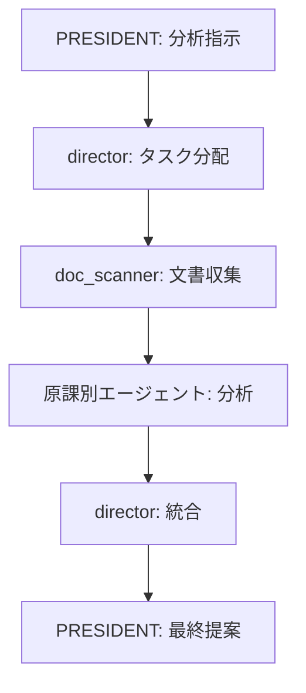

# 🏛️ 自治体営業支援AIエージェントシステム

原課（自治体内の所管課）に対応した専門AIエージェントが連携し、自治体向け営業戦略を支援するマルチエージェントシステム

**📖 Read this in other languages:** [English](README-en.md)

## 🎯 システム概要

自治体の課題やニーズは「原課（部署）」単位で異なるため、各原課に対応する専門エージェントが分析・提案を行います。

### 👥 エージェント構成（初期実装版）

```
📊 PRESIDENT セッション (1ペイン)
└── PRESIDENT: 営業戦略統括・最終提案作成

📊 multiagent セッション (4ペイン)  
├── director: 全体統括・原課横断調整
├── dx_analyst: DX推進課・情報政策課対応
├── admin_analyst: 総務課・企画政策課対応
└── doc_scanner: 計画書・HP情報自動読取
```

### 🏢 対応原課マッピング

| エージェント | 担当原課 | 専門分野 |
|------------|---------|---------|
| dx_analyst | DX推進課、情報政策課 | デジタル施策、業務改善、AI・RPA導入 |
| admin_analyst | 総務課、企画政策課 | 計画策定、自治体経営、組織改革 |
| doc_scanner | 全課横断 | 公開文書・計画書の自動収集・構造化 |

## 🚀 クイックスタート

### 0. リポジトリのクローン

```bash
git clone https://github.com/[your-username]/gov-sales-ai-agents.git
cd gov-sales-ai-agents
```

### 1. 環境構築

```bash
./setup.sh
```

### 2. セッションアタッチ

```bash
# マルチエージェント確認
tmux attach-session -t multiagent

# プレジデント確認（別ターミナルで）
tmux attach-session -t president
```

### 3. Claude Code起動

**手順1: President認証**
```bash
tmux send-keys -t president 'claude' C-m
```

**手順2: Multiagent一括起動**
```bash
for i in {0..3}; do tmux send-keys -t multiagent:0.$i 'claude' C-m; done
```

### 4. 営業分析開始

PRESIDENTセッションで入力：
```
あなたはpresidentです。○○市の総合計画を分析して営業戦略を立案してください
```

## 📋 処理フロー



## 🛠️ 主要機能

### 1. 自動文書収集機能
- 自治体HP・公開文書の自動収集
- 総合計画・個別計画の構造化読取
- 議事録・予算書からの課題抽出

### 2. 原課別分析機能
- 各原課の重点施策・課題を専門的に分析
- 部署間連携の可能性を自動検出
- 導入障壁・推進要因の評価

### 3. 営業戦略生成
- 原課別アプローチ戦略の立案
- キーパーソン・決裁ルートの推定
- 提案タイミング・優先順位の提示

## 📂 プロジェクト構造

```
gov-sales-ai-agents/
├── setup.sh              # 環境構築スクリプト
├── agent-send.sh         # エージェント間通信
├── instructions/         # エージェント指示書
│   ├── president.md      # 統括責任者
│   ├── director.md       # 全体調整役
│   ├── dx_analyst.md     # DX推進分析
│   ├── admin_analyst.md  # 総務企画分析
│   └── doc_scanner.md    # 文書収集役
├── templates/            # 出力テンプレート
│   └── sales_report.md   # 営業提案書式
├── data/                 # 収集データ格納
│   ├── plans/           # 計画書
│   ├── minutes/         # 議事録
│   └── budgets/         # 予算書
└── logs/                # 処理ログ
```

## 🔄 拡張計画

### Phase 2: 原課拡充（6エージェント）
- `welfare_analyst`: 福祉課・高齢者福祉課対応
- `education_analyst`: 教育総務課・子ども家庭課対応

### Phase 3: 全庁対応（11エージェント）
- 全原課カテゴリに専門エージェント配置
- 部門間連携コーディネーター追加

## 🧪 動作確認

### ログ確認
```bash
# 収集文書一覧
ls -la data/plans/

# エージェント通信ログ
cat logs/analysis_log.txt

# 分析結果確認
cat data/analysis_results.json
```

## 🤝 コントリビューション

原課対応の拡充や分析精度向上のPRを歓迎します！

## 📄 ライセンス

[MIT License](LICENSE)

---

🏛️ **自治体営業を科学する** 🤖✨