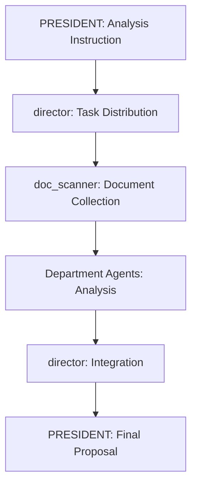

# 🏛️ AI Agent System for Local Government Sales Support

A multi-agent system where specialized AI agents corresponding to local government departments collaborate to support sales strategies.

**📖 Read this in other languages:** [日本語](README.md)

## 🎯 System Overview

Since local government challenges and needs differ by department (Genka), each department has a corresponding specialized agent for analysis and proposals.

### 👥 Agent Configuration (Initial Implementation)

```
📊 PRESIDENT Session (1 pane)
└── PRESIDENT: Sales Strategy Director & Final Proposal Creation

📊 multiagent Session (4 panes)  
├── director: Overall Coordination & Cross-Department Adjustment
├── dx_analyst: Digital Transformation & IT Policy Department
├── admin_analyst: General Affairs & Planning Department
└── doc_scanner: Automatic Document Collection & Structuring
```

### 🏢 Department Mapping

| Agent | Responsible Departments | Specialization |
|-------|------------------------|----------------|
| dx_analyst | DX Promotion, IT Policy | Digital initiatives, process improvement, AI/RPA |
| admin_analyst | General Affairs, Planning | Policy planning, organizational reform |
| doc_scanner | Cross-departmental | Automated collection of public documents |

## 🚀 Quick Start

### 0. Clone Repository

```bash
git clone https://github.com/[your-username]/gov-sales-ai-agents.git
cd gov-sales-ai-agents
```

### 1. Environment Setup

```bash
./setup.sh
```

### 2. Attach Sessions

```bash
# Check multiagent session
tmux attach-session -t multiagent

# Check president session (in another terminal)
tmux attach-session -t president
```

### 3. Launch Claude Code

**Step 1: President Authentication**
```bash
tmux send-keys -t president 'claude' C-m
```

**Step 2: Launch All Multiagent Sessions**
```bash
for i in {0..3}; do tmux send-keys -t multiagent:0.$i 'claude' C-m; done
```

### 4. Start Sales Analysis

Input in PRESIDENT session:
```
You are the president. Analyze the comprehensive plan of [City Name] and develop a sales strategy.
```

## 📋 Process Flow



## 🛠️ Key Features

### 1. Automated Document Collection
- Automatic collection from government websites
- Structured reading of comprehensive and individual plans
- Issue extraction from minutes and budgets

### 2. Department-Specific Analysis
- Professional analysis of priorities and challenges by department
- Automatic detection of inter-departmental collaboration opportunities
- Evaluation of implementation barriers and driving factors

### 3. Sales Strategy Generation
- Department-specific approach strategies
- Key person and decision route estimation
- Proposal timing and priority recommendations

## 📂 Project Structure

```
gov-sales-ai-agents/
├── setup.sh              # Environment setup script
├── agent-send.sh         # Inter-agent communication
├── instructions/         # Agent instructions
│   ├── president.md      # Executive director
│   ├── director.md       # Overall coordinator
│   ├── dx_analyst.md     # DX promotion analysis
│   ├── admin_analyst.md  # General affairs analysis
│   └── doc_scanner.md    # Document collector
├── templates/            # Output templates
│   └── sales_report.md   # Sales proposal format
├── data/                 # Collected data storage
│   ├── plans/           # Planning documents
│   ├── minutes/         # Meeting minutes
│   └── budgets/         # Budget documents
└── logs/                # Process logs
```

## 🔄 Expansion Plan

### Phase 2: Department Expansion (6 agents)
- `welfare_analyst`: Welfare & Senior Services
- `education_analyst`: Education & Child Services

### Phase 3: Full Coverage (11 agents)
- Specialized agents for all department categories
- Addition of inter-departmental coordinators

## 🧪 Operation Verification

### Log Checking
```bash
# List collected documents
ls -la data/plans/

# Agent communication logs
cat logs/analysis_log.txt

# Check analysis results
cat data/analysis_results.json
```

## 🤝 Contributing

PRs for expanding department coverage and improving analysis accuracy are welcome!

## 📄 License

[MIT License](LICENSE)

---

🏛️ **Making Local Government Sales Scientific** 🤖✨