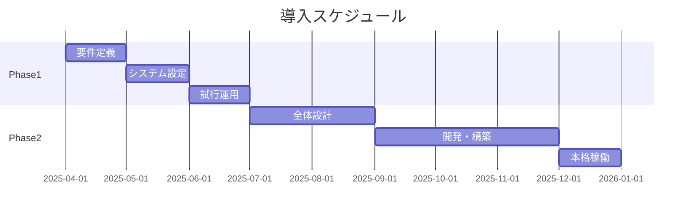

# 【営業提案書】○○市様向けDXソリューション導入のご提案

作成日: 2025年1月XX日  
提案者: [貴社名]

---

## エグゼクティブサマリー

○○市様の「第○次総合計画」および「DX推進計画」を詳細に分析した結果、以下の課題解決と価値創造の機会を特定いたしました。

### 提案概要
- **ソリューション**: [製品・サービス名]
- **対象部署**: DX推進課（第1優先）、総務課（第2優先）
- **想定効果**: 業務時間○%削減、コスト○百万円/年削減
- **投資規模**: 初期費用○百万円、年間保守○百万円
- **導入期間**: ○ヶ月（段階導入可能）

---

## 1. 現状分析

### 1.1 ○○市様の重点施策
貴市の政策文書より、以下を最重要課題として認識しております：

| 施策分野 | 具体的目標 | 現状 | 関連予算 |
|---------|-----------|------|---------|
| 行政デジタル化 | オンライン手続き率50% | 現在○% | ○億円 |
| 業務効率化 | 定型業務の自動化 | RPA○業務導入済 | ○千万円 |
| データ活用 | EBPM推進 | 基盤構築中 | ○千万円 |

### 1.2 原課別ニーズ分析

#### DX推進課
- **ミッション**: 全庁デジタル化の推進
- **課題**: 
  - デジタル人材の不足（専門職員○名）
  - レガシーシステムとの連携
  - 部署間でのデータサイロ化
- **機会**: AI活用指針策定により予算確保見込み

#### 総務課
- **ミッション**: 業務改革・働き方改革
- **課題**:
  - 文書管理の非効率性
  - 超過勤務の削減圧力
  - ナレッジの属人化
- **機会**: トップダウンでの改革機運

---

## 2. ソリューション提案

### 2.1 提案製品・サービス

#### 【第1フェーズ】Quick Win施策（3ヶ月）
```
導入対象: AI-OCR文書処理システム
対象業務: 申請書類のデータ化
期待効果: 処理時間80%削減
投資額: ○百万円
```

#### 【第2フェーズ】本格展開（6-12ヶ月）
```
導入対象: 統合業務支援プラットフォーム
機能: ワークフロー、ナレッジ共有、データ分析
期待効果: 部署間連携強化、意思決定迅速化
投資額: ○千万円
```

### 2.2 他自治体での成功事例

| 自治体名 | 導入ソリューション | 成果 |
|---------|-----------------|------|
| △△市 | 同AI-OCRシステム | 年間○千時間削減 |
| □□市 | 統合プラットフォーム | 決裁期間○日短縮 |

---

## 3. 実装計画

### 3.1 導入ロードマップ



### 3.2 推進体制案

```
【貴市】
プロジェクトオーナー: ○○部長
プロジェクトマネージャー: DX推進課長
実務リーダー: 各課○名

【弊社】
プロジェクトマネージャー: ○○
技術リーダー: ○○
導入支援: ○名
```

---

## 4. 投資対効果

### 4.1 コスト削減効果

| 項目 | 現状コスト | 導入後 | 削減額/年 |
|-----|-----------|--------|----------|
| 人件費（時間外） | ○百万円 | ○百万円 | △百万円 |
| 外部委託費 | ○百万円 | ○百万円 | △百万円 |
| 印刷・保管費 | ○百万円 | ○百万円 | △百万円 |
| **合計** | **○百万円** | **○百万円** | **△百万円** |

### 4.2 定性的効果
- 職員満足度の向上（業務負担軽減）
- 市民サービスの質向上（処理迅速化）
- データに基づく政策立案力強化
- 組織の変革対応力向上

---

## 5. 導入における懸念事項と対策

| 懸念事項 | 対策 |
|---------|------|
| 職員の抵抗感 | 段階導入、丁寧な研修、成功体験の共有 |
| 既存システムとの連携 | API開発、データ移行ツール提供 |
| セキュリティ | LGWAN対応、暗号化、監査ログ |
| 予算確保 | 国の補助金活用支援、費用対効果の明確化 |

---

## 6. なぜ今なのか

1. **政策的追い風**: デジタル田園都市国家構想により補助金充実
2. **組織的機運**: CDO任命、DX推進本部設置により推進力向上
3. **技術的成熟**: AI・クラウド技術の実用化により導入リスク低減
4. **競争優位性**: 近隣自治体に先駆けた導入による差別化

---

## 7. 次のステップ

1. **詳細ヒアリング** (2週間以内)
   - 現場課題の深掘り
   - 要件の具体化

2. **PoC（概念実証）** (1ヶ月)
   - 限定業務での効果検証
   - 導入課題の洗い出し

3. **本提案** (2ヶ月後)
   - 詳細見積・仕様書
   - 契約条件協議

---

## 付録

### A. 会社概要・実績
[貴社の実績・強み]

### B. 製品詳細仕様
[技術仕様書]

### C. サポート体制
[保守・運用支援内容]

### D. 関連補助金情報
[活用可能な国・県の支援制度]

---

**お問い合わせ先**  
[貴社名] 公共営業部  
担当: ○○  
TEL: XXX-XXXX-XXXX  
Email: xxxxx@example.com